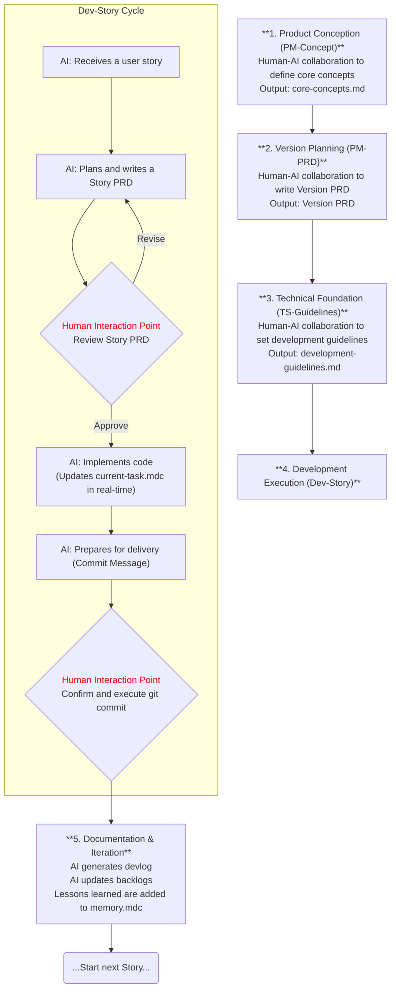

# Cursor-Vibe-Coding: A Human-AI Collaborative Software Development Methodology

Welcome to `Cursor-Vibe-Coding`! This is a highly structured software development workflow designed specifically for **collaboration between humans and AI developers**. It's more than just a collection of tools or files; it's a "Coding Vibe"—a way of working that aims to maximize the potential of human-AI collaboration through a **structured, transparent, auditable, and continuously improving** process.

The core idea of this project is to break down the complex software development process into a series of clearly defined roles, document outputs that follow standard templates, and AI behaviors driven by precise rules, thereby achieving efficient, high-quality development iterations.

## Core Philosophy

- **Structured**: All development activities follow predefined processes and templates, from product conception to code implementation, with clear guidance at every step.
- **Transparent**: The AI's working status and plans are visible in real-time in the `current-task.mdc` file, allowing human collaborators to understand its progress at any time.
- **Collaborative**: Clear human-AI interaction "gates" are set at key nodes (such as PRD reviews, code commits) to ensure a perfect blend of AI autonomy and human oversight.
- **Document-Driven**: The development process is the documentation process. The system produces a series of high-quality, interconnected documents (like PRDs, development guidelines, devlogs), forming a valuable knowledge base.
- **Self-Improving**: A built-in reflection and memory update mechanism enables this workflow to learn and continuously improve from every development practice.

## Project Components

`Cursor-Vibe-Coding` is built on three main pillars, which together define the entire workflow. These configuration files are located in the `.cursor-en` directory by default.

### 1. Roles

The `roles/` directory defines the different "personas" involved in the workflow and their codes of conduct, primarily guiding the AI's interaction patterns and objectives in specific contexts.

- **`role-pm-core-concepts.md`**: The AI acts as a partner to the product manager, collaborating with the user to define the product's **core concepts, philosophy, and principles**.
- **`role-pm-version-prd.md`**: The AI continues in the product manager role, collaborating with the user to write a detailed **Version Product Requirements Document (Version PRD)** and break down high-level goals into user stories.
- **`role-ts-development-guidelines.md`**: The AI transforms into a technical partner, co-creating the project's **development guidelines** with the user. It can analyze existing code to generate a draft reflecting the current state or establish standards with the user from scratch.
- **`role-ai-developer-engineer.md`**: The AI serves as the core **development engineer**, autonomously planning tasks (generating a Story PRD), implementing code according to the PRD and development guidelines, and completing code commits under the user's supervision.
- **`role-debugger.md`**: This is not an interactive role but a detailed **code debugging guide**, providing a systematic problem-solving methodology for all developers (including the AI).

### 2. Templates

The `templates/` directory houses the skeletons for all standard deliverables, ensuring consistency and completeness in documentation.

- **`core-concepts-template.md`**: The template for the "Core Concepts" document.
- **`version-prd-template.md`**: The template for the "Version PRD".
- **`story-prd-template.md`**: The template for the "User Story PRD".
- **`development-guidelines-template.md`**: The template for the project "Development Guidelines," containing extremely detailed front-end and back-end standards.
- **`devlog-template.md`**: The template for the "Devlog," used to record the detailed process of each task.

### 3. Rules

The `rules/` directory contains a series of special `.mdc` files that are the underlying rules and state machine driving the AI's behavior.

- **`project-basic-info.mdc`**: Stores basic project information, such as file paths.
- **`memory.mdc`**: The AI's "long-term memory," which solidifies core principles and best practices that must be followed.
- **`knowledge-stack.mdc`**: The AI's dynamic knowledge base, which can be "loaded" with the context needed to complete a task via links or temporary excerpts.
- **`workflow-guidelines.mdc`**: The meta-rule, defining the AI's basic work loop: locate, follow the role, consult the rules, and check the task.
- **`current-task.mdc`**: The AI's "short-term memory" and task state machine, tracking the current task's goal, plan, steps, and logs in real-time.

## High-Level Workflow

To more intuitively display the dependencies and human-AI collaboration points of each phase, the following diagram depicts the typical workflow of `Cursor-Vibe-Coding`:

A typical `Cursor-Vibe-Coding` workflow is described as follows:

1.  **Product Conception (PM-Concept)**: The user and the AI (`role-pm-core-concepts`) converse to create the `core-concepts.md` document, clarifying the product's core value.
2.  **Version Planning (PM-PRD)**: Next, the user and the AI (`role-pm-version-prd`) collaborate to formulate a detailed `[version]-version-prd.md` based on the core concepts, breaking it down into a series of user stories.
3.  **Technical Foundation (TS-Guidelines)**: Before formal development, the user and the AI (`role-ts-development-guidelines`) work together to create or refine `development-guidelines.md`, establishing unified technical standards for the project.
4.  **Development Execution (Dev-Story)**:
    - The AI engineer (`role-ai-developer-engineer`) takes on a user story.
    - **Planning**: It first analyzes the codebase and writes a detailed **Story PRD**, listing the specific implementation plan, which is then submitted to the user for review.
    - **Execution**: Once the Story PRD is approved, the AI begins coding. It updates `current-task.mdc` in real-time to track its progress.
    - **Delivery**: After coding and self-testing are complete, the AI prepares the `git commit` message and **requests the user to execute the commit operation**.
5.  **Documentation & Iteration**: Upon task completion, the AI generates a detailed `devlog`, updates the technical debt `backlogs`, and gets ready to start the next story. Lessons learned throughout the process can be incorporated into `memory.mdc` or the development guidelines for continuous improvement.

## How to Get Started?

1.  **Initialize Configuration**: Copy the `.cursor-en` directory to your project's root.
2.  **Define Core Concepts**: Try conversing with Cursor, asking it to assume the `role-pm-core-concepts` role to start defining your product.
3.  **Follow the Process**: Follow the workflow described above to progressively create your PRD, development guidelines, and let the AI handle the development.

---

Hopefully, this `Cursor-Vibe-Coding` methodology will bring a smoother, more efficient collaborative experience for you and your AI partner!
