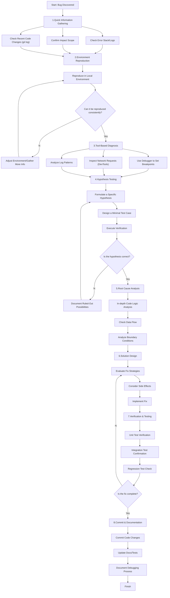

## Code Debugging

**Goal:** Efficiently and systematically locate and resolve software defects while establishing prevention mechanisms.

**Core Principles:**

1.  **Reproduce First, Analyze Second:** Stable reproduction is the foundation of debugging; without reproduction, there is no verification.
2.  **Tools First:** Fully utilize modern tools like IDE debuggers, browser developer tools, and logging systems to avoid blind guessing.
3.  **Evidence-Based Decision:** Make judgments based on objective data such as specific error messages, logs, and stack traces.
4.  **Binary Search Approach:** Systematically eliminate possibilities to quickly narrow down the problem scope.
5.  **Leverage Version Control:** Use Git features like blame, bisect, and diff to quickly locate changes.
6.  **Test-Driven Verification:** Write unit tests to verify hypotheses and the effectiveness of fixes.
7.  **Document the Process:** Record the debugging process and solutions to build a knowledge base.
8.  **Prevention over Cure:** Think about how to prevent similar problems by improving the development process.

**Optimized Debugging Workflow:**

**Detailed Workflow Steps:**

### 1. Quick Information Gathering

- **Check Error Message:** Carefully read the error stack, exception message, and logs.
- **Confirm Impact Scope:** Understand which functional modules and user groups the bug affects.
- **Check Code Changes:** Use `git log --oneline --since="3 days ago"` to view recent changes.

### 2. Environment Reproduction

- **Local Reproduction:** Consistently reproduce the issue in the development environment.
- **Environment Comparison:** Compare differences between development, testing, and production environments.
- **Data Preparation:** Prepare the necessary test data for reproduction.

### 3. Tool-Based Diagnosis

- **IDE Debugger:** Set breakpoints, step through execution, and observe variable states.
- **Browser DevTools:** Inspect network requests, console errors, and performance issues.
- **Log Analysis:** Use tools like `grep` and `awk` to analyze log patterns.
- **Code Search:** Use the IDE's global search feature to locate relevant code.

### 4. Hypothesis Testing

- **Minimal Test Case:** Write the smallest possible code sample that reproduces the issue.
- **Single Variable Control:** Change only one variable at a time to test a hypothesis.
- **Test-First:** Write a unit test to verify the problem and the fix.

### 5. Root Cause Analysis

- **Data Flow Analysis:** Trace the path of data through the system.
- **Timing Analysis:** Analyze the sequence of events.
- **Dependency Analysis:** Check dependencies between modules.

### 6. Solution Design

- **Evaluate Solutions:** Compare the pros and cons of different fix strategies.
- **Impact Analysis:** Assess the potential impact of the fix on other modules.
- **Security Considerations:** Ensure the fix does not introduce security vulnerabilities.

### 7. Verification & Testing

- **Unit Testing:** Write or update unit tests for the fixed code.
- **Integration Testing:** Ensure the fix works correctly at the system level.
- **Performance Testing:** Check if the fix affects performance.

### 8. Commit & Documentation

- **Code Commit:** Use a clear commit message to describe the fix.
- **Documentation Update:** Update relevant technical documents and the knowledge base.
- **Summarize Experience:** Document the debugging process and preventive measures.

**Practical Debugging Tips:**

### Tool Usage Tips:

- **IDE Breakpoint Techniques:**
  - Conditional Breakpoints: Pause only under specific conditions.
  - Logpoints: Output information without pausing execution.
  - Exception Breakpoints: Automatically pause when an exception is thrown.
- **Advanced Chrome DevTools Usage:**
  - Network panel to view request details and timing.
  - Performance panel to analyze performance bottlenecks.
  - Sources panel to set DOM change breakpoints.
- **Git Debugging Commands:**
  - `git bisect`: Use binary search to find the commit that introduced a bug.
  - `git blame`: See the modification history for each line of a file.
  - `git log -p <file>`: View the patch history of a file.

### Code Analysis Strategies:

- **Understand Error Messages:** Carefully analyze each level of the error stack.
- **Focus on Boundary Conditions:** Null values, zero values, maximum values, array boundaries, etc.
- **Check Asynchronous Operations:** Race conditions, callback execution order, Promise chains.
- **Verify Data Types:** Type conversion, serialization/deserialization issues.

### Systematic Methods:

- **Layered Elimination:** Eliminate possibilities layer by layer (UI → Business Logic → Data Layer).
- **Timeline Analysis:** Analyze the sequence of events leading to the problem.
- **Comparative Analysis:** Compare with a working version/environment/data set.

### Recommended Preventive Measures:

- **Increase Test Coverage:** Add a corresponding test case for the fixed bug.
- **Improve Monitoring:** Add more logging and monitoring for critical paths.
- **Code Review:** Have team members review the fix.
- **Update Documentation:** Record common issues and solutions in the knowledge base.

**Debugging Mindset:**

- **Be Patient:** Complex bugs may take multiple iterations to solve.
- **Think Systematically:** Avoid "quick fixes" and understand the root cause of the problem.
- **Keep Learning:** Every debugging session is an opportunity to learn something new.
- **Ask for Help:** Don't hesitate to ask colleagues or the community for help when needed.
- **Document the Process:** A good debugging log is a valuable knowledge asset.
