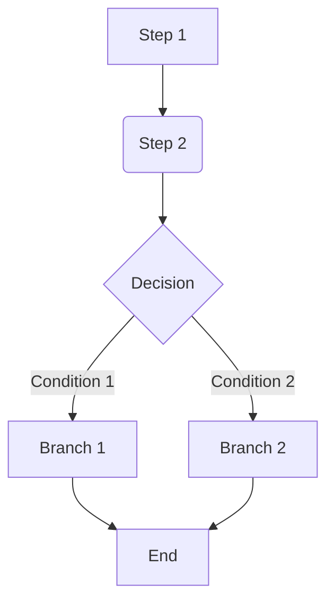

> File naming format template: [project-name]-[prd-version]-version-prd.md
> File path: docs/product/prd/[prd-version]/

# [Project/Feature Name] - Version PRD

**PRD Version**: v0
**Document Version**: 1.0
**Last Updated**: [YYYY-MM-DD]
**Author**: [Your Name / AI Assistant]
**Status**: [Draft / In Review / Finalized]

## 1. Background & Goals

### 1.1 Project Background

- [Briefly describe the project's origin, the problem to be solved, market opportunities, or user pain points.]

### 1.2 Version Goals

- [Clearly state the specific, measurable, achievable, relevant, and time-bound (SMART) goals for this version.]
- **Scope:**
  - **In-Scope:** [List the core features included in this version.]
  - **Out-of-Scope:** [Clearly state what is not included in this version to prevent scope creep.]

### 1.3 Core User Value

- [Explain the core value this version provides to the target users.]

## 2. Macro Design

### 2.1 Positioning & Platform

- [Describe the product's market position, target audience, and target platforms (Web, Desktop, Mobile, etc.).]

### 2.2 Core Flow

- [Use a Mermaid diagram to illustrate the core user journey or business process, showing the main interaction paths.]

### 2.3 Tech Architecture Overview

- [Briefly describe the main technology choices (frontend, backend, key libraries/frameworks), emphasizing any changes from previous versions (if any). e.g., Frontend uses React+Vite+Tailwind, Backend uses FastAPI (as a Piston proxy).]

### 2.4 Key Metrics

- [List the key metrics used to measure the success of the version.]
- [Distinguish between process metrics (e.g., number of code executions) and outcome metrics (e.g., problem pass rate).]

## 3. Planning

### 3.1 [Development Phases & Time Estimation (Optional)]

- [If needed, break down the version development into major phases (e.g., scaffolding, core feature development, testing & release) and provide rough time estimates.]

### 3.2 Key User Stories

- [List the core user stories driving the development of this version, and mark them as Done/TODO. Recommended format: **As a [user type], I want to [do something], so that [I can get some value].**]
- [Story 1: ... (Done/TODO)]
- [Story 2: ... (Done/TODO)(Ref Debt: ...)]
- [...]

## 4. Outline Design

- [Provide a structured overview of the features included in the version, typically serving as an index for the detailed design in Story PRDs.]

### 4.1 [Module Design (Optional)]

- [If the system is complex, it can be broken down into major functional modules.]

### 4.2 Feature List

- [Based on the key user stories, list all the functional points planned for implementation in this version.]
- [Can be organized by module or user story.]

### 4.3 [Page Structure / Information Architecture]

- [Describe the main pages and their organizational relationships, can be represented as a list or a simple tree diagram.]

## 5. Delivery Design

### 5.1 Data Analytics Design

- **Tracking Points:** [List key user behavior tracking points that need to be added or updated, specifying event names, triggers, and key properties.]
- **Reporting Needs:** [Describe the core data reports or metric dashboards that need to be monitored.]

### 5.2 Deployment Preparation

- [List items to consider before launch: e.g., environment configuration, data migration (if any), dependency coordination, rollback plans.]
- [Identify potential risks.]

## 6. Tech Debt Management

- [Document technical debt incurred during the development of this version due to schedule, resource constraints, or other reasons.]
- [Recommended format: `- [Problem description]: [Reason for occurrence] - [Suggested repayment time/plan]`]
- [Can also reference `// TODO: Tech Debt - ...` markers in the code.]
- [Describe reserved interfaces or future optimization directions.]

## 7. Future Considerations

- [Briefly describe the possible next evolutionary directions for the product, features to explore, or optimization points after the successful delivery of the current version.]

## 8. Appendix

- **Related Links:**
  - [Link to prototypes, design mockups, related Story PRDs, technical documents, etc.]
- **Glossary:**
  - [Define key, specific, or easily confused terms in the project.]
- **Revision History:**
  | Version | Last Updated | Description of Changes | Modified By |
  | ------- | ------------ | ---------------------- | ----------- |
  | 1.0 | [Date] | Initial creation | [Name] |
  | ... | ... | ... | ... |
